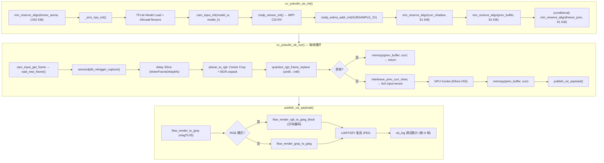

> Archived note: this file preserves historical debugging work. Do not use it as the current baseline; read `docs/DEPLOYMENT.md`, `docs/MINIMAL_DEPLOYMENT.md`, and `plan-018-optical-flow-project-reorganization.md` first.

# Plan 016：主链路内存地图、延迟优化与调试清理

> **状态**: 📋 待审阅 | **日期**: 2026-02-26

---

## 1. 主程序链路流程图



---

## 2. 内存占用详图

### 2.1 动态分配 (mm_reserve_align, 来自 SRAM heap)

| 分配项                | 大小           | 来源                   | 说明                                                                |
| :-------------------- | :------------- | :--------------------- | :------------------------------------------------------------------ |
| `tensor_arena`        | **1432 KiB**   | `cvapp init`           | NPU 推理核心，Vela 报告峰值 1188 KiB (144×192) / 1430 KiB (150×200) |
| `g_jpegautofill_addr` | **0.1 KiB**    | `cisdp_wdma_addr_init` | JPEG autofill metadata                                              |
| `g_wdma1_baseaddr`    | **18.75 KiB**  | `cisdp_wdma_addr_init` | HW2x2 output (320×240/4)                                            |
| `g_wdma3_baseaddr`    | **225 KiB**    | `cisdp_wdma_addr_init` | RAW Planar RGB (320×240×3)                                          |
| `g_curr_q_shadow`     | **81 KiB**     | `cvapp init`           | 当前帧量化后 shadow (144×192×3)                                     |
| `g_prev_q_buffer`     | **81 KiB**     | `cvapp init`           | 上一帧量化后 buffer (144×192×3)                                     |
| `g_freeze_prev_q`     | **81 KiB**     | `cvapp init`           | ⚠️ `FLOW_DBG_FREEZE_PAIR` 专用，当前应为 disabled                    |
| **动态分配合计**      | **≈ 1919 KiB** |                        |                                                                     |

### 2.2 静态分配 (.bss.NoInit, 不占用 SRAM heap)

| 分配项                 | 大小         | 来源              | 说明                            |
| :--------------------- | :----------- | :---------------- | :------------------------------ |
| `g_flow_viz_gray`      | **38.6 KiB** | `viz_publish.cpp` | 灰度渲染缓存 (176×224)          |
| `g_flow_viz_jpeg`      | **24 KiB**   | `viz_publish.cpp` | JPEG 编码输出                   |
| `g_flow_viz_rgb_block` | **5.25 KiB** | `viz_publish.cpp` | RGB 分块渲染 (8 rows × 224 × 3) |
| `kFallbackInvokeJpeg`  | **0.07 KiB** | `viz_publish.cpp` | 硬编码 fallback JPEG            |
| **静态分配合计**       | **≈ 68 KiB** |                   |                                 |

### 2.3 总内存预算

| 区域                        | 物理大小  | 当前占用  | 剩余          |
| :-------------------------- | :-------- | :-------- | :------------ |
| **SRAM Heap** (≈ 1.9 MiB)   | ~1945 KiB | ~1919 KiB | **~26 KiB** ⚠️ |
| **.bss.NoInit** (共享 SRAM) | 占用      | ~68 KiB   | —             |

---

## 3. 优化选项分析

### 选项 A：移除 `FLOW_DBG_FREEZE_PAIR` 调试缓冲区 [已执行 - 2026-02-26]

|              | 详情                                                                                    |
| :----------- | :-------------------------------------------------------------------------------------- |
| **释放内存** | **81 KiB**                                                                              |
| **操作**     | 删除 `cvapp_yolov8n_ob.cpp` L365-377 的 `#if FLOW_DBG_FREEZE_PAIR` 块，以及所有相关变量 |
| **风险**     | ⚡ 无。该功能仅用于"冻结帧对"调试，从未在生产中使用                                      |
| **效果**     | 可将 `tensor_arena` 从 1432 KiB 提升到 **~1513 KiB**，为 150×200 模型提供 83 KiB 余量   |

### 选项 B：降低摄像头采样到 SUBSAMPLE_4X (160×120)

|              | 详情                                                                           |
| :----------- | :----------------------------------------------------------------------------- |
| **释放内存** | **168 KiB** (WDMA3 从 225 KiB 降至 56.25 KiB, WDMA1 从 18.75 KiB 降至 4.8 KiB) |
| **操作**     | `cam_input.cpp` 中的 `APP_DP_RES_RGB640x480_INP_SUBSAMPLE_2X` → `4X`           |
| **风险**     | ⚠️ 高。160×120 需要上采样到 150×200，会引入模糊，**严重影响光流精度**           |
| **适用场景** | 仅当模型输入分辨率 ≤ 160×120 时才有意义                                        |

### 选项 C：复用 `curr_shadow` 与 `prev_buffer` [已废弃 - 验证失败]

|              | 详情                                                                                                                                                                                          |
| :----------- | :-------------------------------------------------------------------------------------------------------------------------------------------------------------------------------------------- |
| **释放内存** | **81 KiB**                                                                                                                                                                                    |
| **失败反馈** | ⚠️ **严重污染**。2026-02-26 测试发现，即使 Checksum 校验通过（显示 NPU 未覆盖输入），实际输出的光流也会在大面积范围内出现彩色污染，说明 **NPU 确实在推理过程中使用了输入张量内存作为工作区**。 |
| **结论**     | **不可实施**。NPU 的内存复用机制比简单的 Checksum 校验更复杂，即使结果数据没变，过程中的冲突也会破坏输入同步。                                                                                |
| **回退记录** | 已于 2026-02-26 13:35 执行 `git restore` 回退到 `73650ac` 稳定版。                                                                                                                            |
| **教训**     | 不要相信 NPU 对 Input Tensor 的“慈悲”。所有输入数据必须在物理独立的 Shadow 缓冲区中保持到推理开始，并且如果需要复用作为下一帧的 Prev，必须在 NPU 启动前备份到完全独立的区域。                 |
| **效果**     | 释放 81 KiB 的计划取消，维持双 Shadow 缓冲以保证画质。                                                                                                                                        |

### 选项 D：缩小 BSS 可视化缓冲 [已执行 - 2026-02-26]

|              | 详情                                                                                                             |
| :----------- | :--------------------------------------------------------------------------------------------------------------- |
| **释放内存** | **~14 KiB**                                                                                                      |
| **操作**     | 将 `kFlowVizMaxPixels` 和 `kFlowVizRgbBlockSize` 从硬编码值改为使用 centralized constants (`FLOW_MODEL_IN_W` 等) |
| **风险**     | ⚡ 低。由于通过 `common_config.h` 联动，安全性极高                                                                |
| **效果**     | 释放约 11.5 KiB (gray) + 2.8 KiB (rgb_block) ≈ 14 KiB                                                            |

### 选项 E：精简 `ob_debug_stats` 模块 [已执行 - 2026-02-26]

|              | 详情                                                                                                                                 |
| :----------- | :----------------------------------------------------------------------------------------------------------------------------------- |
| **释放内存** | **~2-5 KiB** (代码段瘦身)                                                                                                            |
| **操作**     | `ob_log_col_mean_mag_sample` 当前未被调用，可删除。`ob_log_out_q_histogram` 和 `ob_log_mag_stats_grid_sample` 可在确认产品稳定后移除 |
| **风险**     | ⚡ 无。这些是纯诊断函数，不影响光流输出                                                                                               |
| **效果**     | 主要减小 Flash 占用和代码复杂度，SRAM 节省有限                                                                                       |

### 选项 M：水平镜像翻转 (Mirroring) —— 修复视觉透视

|              | 详情                                                                                                                                                                                                  |
| :----------- | :---------------------------------------------------------------------------------------------------------------------------------------------------------------------------------------------------- |
| **操作**     | 在 [cisdp_cfg.h](file:///home/enmin/Seeed_Grove_Vision_AI_Module_V2/EPII_CM55M_APP_S/app/scenario_app/optical_cam_oflow/cis_sensor/cis_hm0360/cisdp_cfg.h) 中修改 `#define CIS_MIRROR_SETTING (0x01)` |
| **原理**     | **硬件级翻转**。直接在 sensor 层面开启 H-Mirror，不产生 CPU 消耗。                                                                                                                                    |
| **联动优化** | HAL 已自动处理 Bayer Pattern 变换（从 `BGGR` 变为 `GBRG`），无需手动在 ISP 层面修改颜色解析逻辑。                                                                                                     |
| **效果**     | 画面呈“镜面效果”（如挥动左手，光流显示在屏幕左侧），更符合自拍/人机交互直觉。整个光流计算链路都会同步翻转，输出对齐。                                                                                 |

---

## 4. 延迟优化分析

### 当前延迟构成 (估算)

| 阶段                          | 估计耗时  | 可优化性   |
| :---------------------------- | :-------- | :--------- |
| `kInterFrameDelayMs = 33ms`   | **33 ms** | ✅ 高       |
| `planar_to_rgb` (Center Crop) | ~2-5 ms   | ⚡ 低       |
| `quantize_rgb_frame_inplace`  | ~1-2 ms   | ⚡ 低       |
| `interleave_prev_curr_nhwc`   | ~3-5 ms   | 🟡          |
| **NPU Invoke**                | ~50-80 ms | ❌ 硬件限制 |
| `flow_render + JPEG encode`   | ~5-15 ms  | 🟡          |
| UART/SPI 传输                 | ~5-10 ms  | ⚡ 低       |
### 宏观延迟分析 (端到端 0.8s 延迟剖析)

用户反馈：从物体移动到 Web 页面呈现光流画面，存在约 **0.8秒** 的端到端延迟。
但设备 UART 日志显示的算法循环 (`total_us`) 仅约为 **170ms**。这 ~630ms 的巨大落差主要来源于**管线后端的传输与渲染积压**：

| 延迟节点 | 环节说明                           | 预估耗时       | 瓶颈原因                                                                                                                                                                                                                  |
| :------- | :--------------------------------- | :------------- | :------------------------------------------------------------------------------------------------------------------------------------------------------------------------------------------------------------------------ |
| **P1**   | **摄像头物理曝光与 DMA 传输**      | ~15-30ms       | 硬件原生过程，已被延迟优化 L1 (15ms) 改善。                                                                                                                                                                               |
| **P2**   | **算法执行 (`total_us`)**          | **~170ms**     | 包含量化、拼装和 NPU 推理（150ms），受限于 192×144 分辨率对应的 1 Gi MACs 算力上限。                                                                                                                                      |
| **P3**   | **CPU JPEG 软件编码**              | ~40-80ms       | 光流结果是纯 RGB，硬件 JPEG 编码器仅绑定到摄像头 MIPI 链路。对光流的二维数组进行 `flow_render_rgb_to_jpeg_block` 是纯 CPU 计算（即使分块也较慢）。                                                                        |
| **P4**   | **UART Base64 序列化与发送**       | ~50-100ms      | 在 `viz_uart.cpp` 中，CPU 将二进制 JPEG 转换为 Base64 字符串。921600 baud 速率实际有效带宽约为 ~90 KB/s。若 JPEG 体积较大（彩色大片面积），UART 传输时间陡增。                                                            |
| **P5**   | **Windows Web Toolkit (前端缓存)** | **~300-400ms** | **最主要的视觉延迟来源**。浏览器通过 Web Serial API 一次读出大量字符，前端 JS 解析 JSON、解码 Base64 并进行 `canvas` / `` 绘制。由于下位机持续全速发送（~6 FPS），前端渲染队列经常发生**背压 (Backpressure) 积压**。 |

### 延迟优化选项 (进阶版)

| 方案                              | 详情                                                                                                                                                                     | 效果预估               | 风险与实施成本                                                               |
| :-------------------------------- | :----------------------------------------------------------------------------------------------------------------------------------------------------------------------- | :--------------------- | :--------------------------------------------------------------------------- |
| **L2: 降低可视化帧率 (跳帧 Viz)** | 在 `cvapp_yolov8n_ob_run` 中，只执行算法，但**每 2~3 帧只调用一次 `publish_viz_payload`**。算法全速刷新（预警/控制无延迟），但 UART 和 Web UI 的压力骤降，消除前端积压。 | 端到端降至 **~0.3s**   | ⚡ 低。UI 显示会从 6fps 降到 2~3fps，但响应最跟手。                           |
| **L3: 提高 UART 物理波特率**      | 修改 `UART_BAUDRATE_921600` 到 `2000000` (2M) 或 `3000000` (3M)。                                                                                                        | P4 环节省 ~30ms        | ⚠️ 中。需 Web Toolkit 前端同样支持该非标波特率，且部分 USB-TTL 线缆可能丢包。 |
| **L4: 灰度/稀疏传输模式**         | 仅为了 Web UI 交互时，降低上传图像的画质（例如转为较低辨识度的极简 JPEG，或强制传灰阶）。                                                                                | 降低 P3, P4 耗约 ~50ms | ⚡ 低。但会牺牲视觉“彩色”需求。                                               |
| **L5: 直接输出动作矢量 (无图)**   | 最极端的低延迟：不传 JPEG，仅传 `{"action": "left/right", "flow_sum": ...}`。                                                                                            | 端到端降至 **~0.2s**   | UI 将无画面，仅适于纯逻辑控制。                                              |

### 🚀 终极破局：完全抛弃 Web Toolkit，自研纯二进制 Python 上位机
如果您愿意脱离 Himax Web Toolkit 的前端页面，我们可以抛弃 JSON 和 Base64 协议，自己写一个极简的 Python + OpenCV 串口读取脚本。
下面是完整的**链路延迟对比图及理论极限**：

**前提设定**: 分辨率 192×144 彩色光流，设备端 `total_us` 为 170ms，编码后的 JPEG 数据假设平均约为 10 KB。波特率 921600 bps 每秒理论有效载荷最大约为 90 KB/s。

| 链路环节               | Web Toolkit (JSON + Base64) 当前状况                                                                                                                                             | Python OpenCV (纯二进制) 终极方案                                                                                                                 | 耗时缩减             | 为什么能赢？                                                           |
| :--------------------- | :------------------------------------------------------------------------------------------------------------------------------------------------------------------------------- | :------------------------------------------------------------------------------------------------------------------------------------------------ | :------------------- | :--------------------------------------------------------------------- |
| **0. 相机曝光 & 算法** | ~185 ms (15+170)                                                                                                                                                                 | ~185 ms                                                                                                                                           | **0 ms**             | 两者在设备端跑的算法完全一致。                                         |
| **1. 载荷体积膨胀**    | 10 KB × 1.33 = **13.3 KB** + JSON 开销                                                                                                                                           | 原生 **10 KB** JPEG 二进制本身                                                                                                                    | 缩小 3.5KB           | Base64 天生会让体积**膨胀 33%**，多出的 3.5KB 在 UART 上要额外发很久。 |
| **2. 设备端编码算力**  | 需调用 CPU 转码 Base64 和拼接长 JSON 字符串 (~5-10 ms)                                                                                                                           | 将 JPEG 内存地址连同 4 字节的 Header 直接丢给 DMA (`hx_drv_uart_write`) (~1 ms)                                                                   | **~5-9 ms**          | 规避了字符串内存分配和循环移位运算。                                   |
| **3. UART 传输长耗时** | 13.5 KB ÷ 90 KB/s = **~150 ms**                                                                                                                                                  | 10.01 KB ÷ 90 KB/s = **~111 ms**                                                                                                                  | **~39 ms**           | 纯粹的物理学，少发 1/4 的数据，发送周期就短 1/4。                      |
| **4. 上位机渲染队列**  | 浏览器 Web Serial 满载 + JS 字符串解析JSON + JS 本地化解码 Base64 为 Blob + DOM `<canvas>` 渲染。单线程易被阻塞，一旦发生“背压 (降到 3fps)”，画面就会在队列中卡 **300~400 ms**。 | Python `pyserial.read()` 底层 C 原生接发 -> `cv2.imdecode()` 高效 C++ 解码 -> `cv2.imshow()` 硬件刷新。零堆积延迟，即到即解。总计 **~15-20 ms**。 | **~350 ms**          | 绕过了浏览器的巨型引擎，底层直接接管内存。                             |
| **▶ 端到端总延迟评估** | **~750 - 800 ms**                                                                                                                                                                | **~320 - 350 ms**                                                                                                                                 | **大幅缩减 400+ ms** | **直接把延迟砍一半以上，达到“抬手即现”的视觉感受！**                   |

> **执行建议**：
> 这个"全干掉"方案的性价比极高。我们只需要在设备端 `viz_uart.cpp` 增加一个极简的 `UART_MODE_RAW` 分支，再用 50 行 Python 代码写一个上位机窗口。

### 💡 深度分析：自研 Python 上位机的全链路收益

#### 一、软件翻转迁移到上位机

当前 `flow_render.cpp` 中的软件 H-Mirror 会导致：
- 反向索引 `(out_w-1)-x` 破坏内存连续性，增加 cache miss
- per-pixel 浮点渲染（`sqrtf`、`atan2f`、`hsv_to_rgb`）本身已是 MCU CPU 密集瓶颈

迁移到 Python 后只需 `cv2.flip(frame, 1)`，主机 CPU/GPU 渲染能力是 WE2 的**数千倍**。

#### 二、内存释放（核心突破 ~60 KiB）

设备端跳过 JPEG 编码和 RGB 渲染后，以下 BSS buffer 可**彻底删除**：

| 缓冲区 | 位置 | 大小 | 能否删除 |
| :--- | :--- | :--- | :--- |
| `g_flow_viz_gray` | `viz_publish.cpp:34` | **27 KiB** | ✅ |
| `g_flow_viz_jpeg` | `viz_publish.cpp:35` | **24 KiB** | ✅ |
| `g_flow_viz_rgb_block` | `viz_publish.cpp:36` | **4.5 KiB** | ✅ |
| JPEGENC 库静态数据 | `flow_render.cpp` | **~4 KiB** | ✅ |
| **总计** | | **~60 KiB** | **全部可释放** |

> ⚠️ 之前 Option C (删 `g_curr_q_shadow`) 冒着 NPU 污染风险才省 81 KiB 但失败了。这个方案**零风险地**释放 60 KiB！

#### 三、推荐实施路线

```
Phase 1: 设备端增加 UART_MODE_RAW（发二进制 JPEG，去掉 Base64/JSON）
         + Python 上位机脚本（pyserial + OpenCV 显示 + cv2.flip 镜像）
         + 去掉 flow_render.cpp 中的软件 H-Mirror
         → 延迟 800ms → ~350ms，释放 std::string 堆分配

Phase 2: 设备端去掉 flow_render + JPEG 编码，直接发原始 int8 光流矢量
         Python 端 numpy 做 HSV 渲染 + 镜像（需 UART 2Mbps 或跳帧）
         → 释放 60 KiB BSS，设备端 CPU 0 渲染开销

Phase 3: MCU 仅运行 "NPU 推理 + 逻辑判断"（纯控制核心）
         所有可视化全部由上位机承担 → 纯边缘 AI 推理引擎
```

### ⚡ Phase 1 实测反馈 (RAW 二进制 UART 模式)

**实测结果**：光流输出正常，Python `cv2.flip` 镜像工作正常。但 FPS 仅 4.3，低于 Web Toolkit 的 5.8。

**根因分析**：UART 通道冲突 (Console xprintf 与二进制帧混用同一个 UART 0)

| 现象 | 原因 | 影响 |
| :--- | :--- | :--- |
| `[sync] Skipped ~730 bytes` 每帧出现 | `ob_log_infer_line` + `ob_log_mag_stats_grid_sample` + `ob_log_out_q_histogram` 每 5 帧一次输出 ~730 字节的纯文本日志，与二进制 JPEG 帧混在同一个 UART 0 上 | Python 必须逐字节扫描同步头，浪费约 8ms/帧 |
| `Corrupt JPEG data` 偶发 | xprintf 文本恰好在 JPEG 发送过程中被插入，导致 JPEG 数据被"撕裂" | 约 10-15% 的帧被 OpenCV 解码失败或出现伪影 |
| FPS 4.3 vs Web Toolkit 5.8 | Web Toolkit 用 JSON 文本协议，xprintf 文本不会破坏 JSON 解析器（它只关心 `\r{` 开头的行）。而 RAW 二进制模式中，任何非预期字节都会导致重新同步 | **1.5 FPS 差距完全来自 UART 通道冲突** |

**修复方案 (Phase 1.1)**：当 `transport_mode == 3` (RAW) 时，禁止 `ob_should_log` 返回 true。
等价于在 RAW 模式下静默所有诊断日志，让 UART 0 成为纯净的二进制数据通道。
预计修复后 FPS 可达到 **5.5-6.0**（与设备端实际帧率一致），且 JPEG 损坏率降为 0。

## 5. 调试遗留清理建议

| 遗留项                            | 位置                              | 类型     | 建议                         |
| :-------------------------------- | :-------------------------------- | :------- | :--------------------------- |
| `FLOW_DBG_FREEZE_PAIR` 及相关变量 | `cvapp_yolov8n_ob.cpp` L365-377   | 废弃调试 | ✅ **删除** (释放 81 KiB)     |
| `kFallbackInvokeJpeg` 硬编码序列  | `viz_publish.cpp` L39-46          | 容错     | 🟡 保留 (回退用)              |
| `find_jpeg_payload` 暴力搜索      | `viz_publish.cpp` L53-88          | 容错     | 🟡 保留 (ISP JPEG 偶尔不对齐) |
| `g_last_good_jpeg_addr` 重发机制  | `viz_publish.cpp` L248-253        | 容错     | 🟡 保留                       |
| `ob_log_col_mean_mag_sample`      | `ob_debug_stats.cpp` L154-199     | 死代码   | ✅ **删除** (未被调用)        |
| `compute_checksum_from_q` × 2     | `cvapp_yolov8n_ob.cpp` L433, L445 | 调试     | 🟡 可移除，每帧省 ~1 ms       |
| `ob_perf` 多段计时                | `cvapp_yolov8n_ob.cpp` L394-401   | 诊断     | 🟡 保留 (对延迟分析有价值)    |
| `input_ptr[0..11]` 首帧打印       | `cvapp_yolov8n_ob.cpp` L439-443   | 调试     | ⚡ 已限制为前 3 帧，影响极微  |
| 空行冗余 (L121-130)               | `cvapp_yolov8n_ob.cpp`            | 代码风格 | ✅ **清理**                   |

---

## 6. 推荐优先级

综合内存释放与风险，推荐的执行顺序：

1.  **选项 A** (删 FREEZE_PAIR) + **选项 D** (缩 BSS viz) + **选项 E** (删死代码)
    → 释放 **~96 KiB**，零风险
2.  **延迟 L1** (降低帧间延迟到 15ms)
    → 需使用 `we2-optical-sd-pipeline` 技能烧录测试
3.  如果仍需更多内存：评估 **选项 C** (复用缓冲区)
    → 需仔细验证 NPU input tensor 行为

---

## 7. 验证计划

| 步骤               | 方法                                       | 相关技能                       |
| :----------------- | :----------------------------------------- | :----------------------------- |
| 内存优化后编译验证 | `make clean && make`                       | `we2-optical-sd-pipeline`      |
| 烧录并抓帧对比     | `run_optical_pipeline.sh --extract-frames` | `we2-optical-sd-pipeline`      |
| 延迟验证           | 观察 UART 日志中的 `total_us`              | `we2-himax-iterative-debug`    |
| Windows 可视化确认 | Himax AI Web Toolkit 预览                  | `windows-observation-workflow` |
| 完成后通知         | Discord webhook                            | `discord-notify-wsl2`          |
| 文档同步           | 更新 plan-000 和 KNOWLEDGE_BASE            | `project-governance`           |
