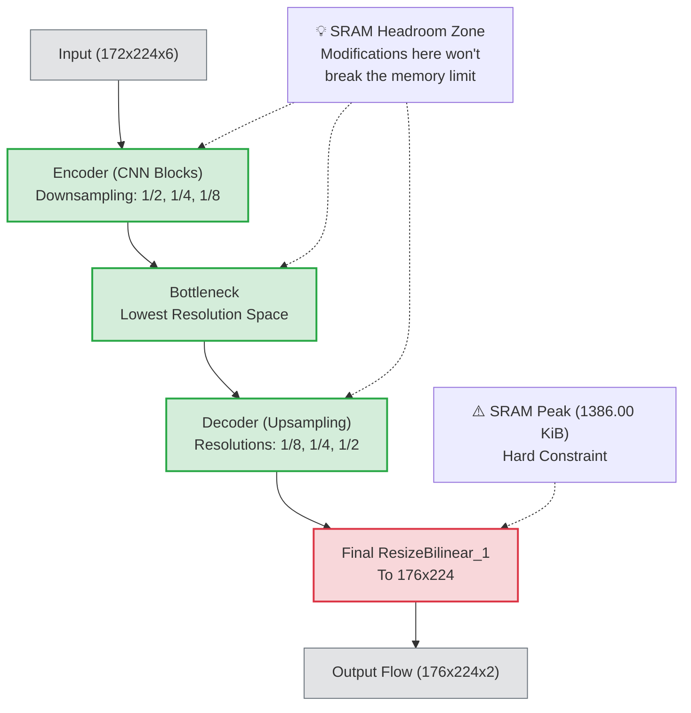
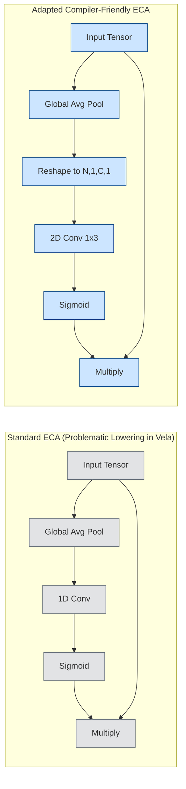
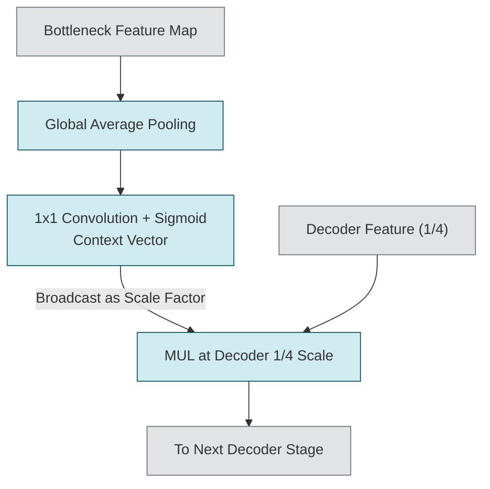
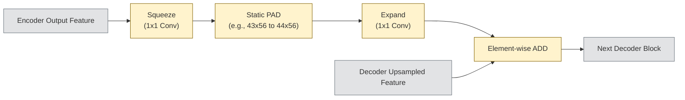

# Stage Summary: Optical Flow Model Architecture Design

## 1. Background & Design Constraints

### Core Objective
To enhance the accuracy (ACC) and cross-domain generalization of the optical flow model under strict hardware deployment constraints: an `SRAM peak ≤ 1386.00 KiB` and acceptable `FPS` deviations. The baseline architecture is the searched neural architecture backbone (`0,2,1,1,0,0,0,0,0`), specifically its **EdgeFlowNet Bilinear version**, which features a pure encoder-decoder structure without any baseline skip connections.

### Strategic Advantage: Turning a Bottleneck into an Opportunity
Our profiling revealed that the un-optimizable SRAM memory peak in our baseline occurs at the very end of the decoder processing (specifically at the final `ResizeBilinear_1` node). Rather than seeing this strictly as a limitation, we identified it as a massive opportunity: it provides a hidden "SRAM headroom" for the early and middle stages of the network. We can inject sophisticated structural connections and attention operations in these earlier stages (Encoder, Bottleneck, early Decoder) to boost accuracy, knowing that as long as we don't surpass that final tail peak of 1386.00 KiB, the overall SRAM constraint remains perfectly safe and allocatable on the Ethos-U55 NPU.

### Diagram 1: Base Architecture Framework
The following diagram illustrates the original EdgeFlowNet Bilinear backbone. Note that this is **not** a U-Net skeleton; it contains zero skip connections by default. The diagram highlights the SRAM tail-peak and the "safe zones" for architectural modifications.

---

## 2. Modular Architecture Design

To fully utilize the SRAM headroom, we explored three major architectural additions.

### A. Channel Attention (ECA-style Adaptation)
*   **Reference Source:** Inspired by *ECA-Net: Efficient Channel Attention for Deep Convolutional Neural Networks* (Wang et al., CVPR 2020).
*   **Problem Addressed:** Standard SE-Net (Squeeze-and-Excitation) relies on dimensionality reduction operations (squeeze dense layers) which disrupt the direct correspondence between channels and their weights, degrading the channel attention learning efficacy. ECA-Net proposes avoiding dimensionality reduction by using a fast 1D convolution to capture **local cross-channel interactions** (where each channel only interacts with its $k$ immediate neighbors). However, native 1D convolutions or tensor transpositions are poorly supported or incur heavy performance penalties (slow lowerings) on the Ethos-U55 compiler (Vela) toolchain.
*   **Design Consideration & Adaptation:** We adapted the ECA module into a compiler-friendly format without transpositions: `Global MEAN -> Reshape to [N, 1, C, 1] -> 2D Convolution (1x3 kernel) -> Sigmoid -> MUL`. This logic perfectly circumvents the hardware operation-support issues while maintaining cross-channel interaction efficacy.
*   **Operator-Level Breakdown:**
    1.  **Global Average Pooling (MEAN):** Collapses spatial dimensions (`HxW`) into a single pixel. This forces the metric to purely represent "what" features exist globally across the channel, irrespective of "where" they are.
    2.  **Reshape & 2D Conv (1x3):** A workaround for Vela's poor 1D Convolution support. This step performs the crucial cross-channel communication linearly, letting adjacent channels influence each other's importance scoring without applying destructive dimensionality reduction.
    3.  **Sigmoid:** Normalizes these channel interactions into a `0 to 1` scaling factor.
    4.  **Multiply (MUL):** Re-weights the original Bottleneck channels, amplifying the useful features and silencing the noise.
*   **How it Improves the Baseline:** The original EdgeFlowNet baseline treats all feature channels at the bottleneck equally, which limits its ability to focus on the most critical semantic features before beginning the upsampling process. By introducing our adapted ECA, we force the network to dynamically recalibrate these bottleneck features—suppressing noisy channels and amplifying the ones most relevant to optical flow—without the heavy parameter cost of traditional attention mechanisms. This "purifies" the feature map at the lowest resolution, providing a much higher quality foundation for the decoder.

### B. Global Cross-Layer Gating (Global Gate)
*   **Reference Source:** Conceptual fusion inspired by spatial broadcast concepts in *Squeeze-and-Excitation Networks* (Hu et al., CVPR 2018) and *Non-local Neural Networks* (Wang et al., CVPR 2018), adapted specifically for an asymmetric encoder-decoder.
*   **Problem Addressed:** Long-range contextual information is easily lost during the decoding upsampling process. However, typical spatial attention operations are too mathematically dense to compute on high-resolution feature maps.
*   **Design Consideration:** We extract a highly condensed global context vector from the bottleneck and broadcast it forward to specific decoder scales (e.g., the 1/4 scale). This vector acts as a spatial scale multiplier. It cleverly avoids introducing massive computational loads at high resolutions while preserving fundamental global orientation.
*   **Operator-Level Breakdown:**
    1.  **Global Average Pooling (MEAN):** Extracts a pure, scale-invariant semantic vector from the bottleneck. By flattening out the remaining spatial dimensions, it completely removes local distractions, distilling the absolute "global context" of the frame.
    2.  **1x1 Convolution:** Acts as a strict channel projection/aligner. It translates the channel dimension of the bottleneck context vector (e.g., 64 channels) into the exact channel count of the target high-resolution decoder stage (e.g., 32 channels), making them mathematically compatible for fusion without risking shape mismatches.
    3.  **Sigmoid:** Normalizes the aligned vector into a percentage-based activation weight.
    4.  **Multiply (MUL):** Broadcasts this single, globally-aware vector across every single spatial pixel of the target high-resolution decoder feature map. This provides a unified, coherent tuning signal to all localized regions simultaneously.
*   **How it Improves the Baseline:** In the baseline architecture, the decoder must rebuild the spatial resolution entirely from the adjacent lower-level features. During this step-by-step upsampling, the "big picture" (the global context of the entire frame) is often diluted or lost, causing the network to struggle with large displacements or uniform regions. The Global Gate solves this by acting as a direct "shortcut" or "beacon" from the most condensed semantic layer (the bottleneck) to the higher-resolution decoding layers. It continuously reminds the decoder of the overall motion context, ensuring that local upsampling decisions remain globally coherent, all with the negligible cost of a single 1x1 convolution and multiplication.

### C. Compressed Additive Skips (U-Net-like Long Connections)
*   **Reference Source:** Inspired by the macro-architecture of *U-Net* (Ronneberger et al., MICCAI 2015) and the inverted residual block bottlenecks from *MobileNetV2/V3* (Sandler et al., CVPR 2018; Howard et al., ICCV 2019).
*   **Problem Addressed:** Standard U-Net `CONCAT` operations drastically widen channel dimensions, failing memory constraints. Furthermore, pushing dense high-resolution (1/2 scale) skips introduces excessive local details that hurt cross-domain generalization (e.g., on the Sintel dataset) and heavily bloats the network utilization (Network%), dragging down FPS. 
*   **Operator-Level Breakdown (Why "Compressed"?):** We discarded `CONCAT` entirely in favor of an Additive approach, restricted predominantly to low/mid scales (1/8 and 1/4). To minimize computation, the pipeline is highly specific. Taking the **1/4 scale skip** as an example:
    1.  **Squeeze (1x1 Conv):** Rapidly reduces the channel dimension of the high-capacity encoder feature map (e.g., compressing from `64` channels down to `16` channels).
    2.  **Static PAD:** Solves a crucial odd-resolution geometry mismatch (e.g., matching a `43x56` encoder output to a `44x56` decoder input induced by the `172x224` input), ensuring the compiler doesn't fall back to unoptimized asynchronous operations.
    3.  **Expand (1x1 Conv):** Restores the channels to align perfectly with the incoming decoder features (e.g., expanding from `16` channels back to `32` channels).
    4.  **Add:** Fuses the features seamlessly.
*   **How it Improves the Baseline:** The original bilinear baseline is a pure Encoder-Decoder. This means any high-resolution spatial details lost during the initial downsampling (Encoder) are gone forever; the Decoder has to essentially "guess" these details, leading to blurry or imprecise optical flow boundaries. By adding these highly compressed skips, we provide the Decoder with explicit, high-resolution spatial templates directly from the Encoder. The "Compression" via 1x1 convolutions ensures we only pass the most critical spatial hints without violating our strict `1386.00 KiB` SRAM limit or destroying the FPS, effectively bridging the gap between coarse semantics and fine spatial boundaries.

---

## 3. Hardware Deployment Benchmarks (Vela & On-Board Profiling)

Before investing massive computing resources into training, every structural combination underwent compiler (Vela) pre-checks and actual microcontroller execution. This empirically proved our theory about the "SRAM headroom" and validated the actual frame rate (FPS) costs.

| Model Variant | SRAM Peak | Vela Infer Time | Board Infer Time | Assessment |
| :--- | :--- | :--- | :--- | :--- |
| `Bilinear Baseline` | **1386.00 KiB** | ~173.1 ms | **178.5 ms** | Base Reference |
| `LiteASPP` | 1386.00 KiB | 181.0 ms | 186.8 ms | Dropped (Too heavy) |
| `ECA` (Bottleneck to Decoder) | 1386.00 KiB | 175.2 ms | 180.0 ms | Feasible |
| `GlobalGate 4x` (baseline + gate) | 1386.00 KiB | 174.3 ms | 179.6 ms | Excellent |
| `globalgate4x_bneckeca` | **1386.00 KiB** | **174.6 ms** | **179.8 ms** | **Exceptional Base Candidate** |
| `globalgate4x_bneckeca_skip8x4x` | 1386.00 KiB | 178.3 ms | N/A | Multi-Scale Candidate |
| `globalgate4x_bneckeca_skip8x4x2x` | 1386.00 KiB | **182.9 ms** | N/A | Heavy Limit Benchmark |

**Hardware Conclusions:** 
The benchmarking proved that we successfully shielded the `SRAM Peak` at exactly 1386.00 KiB across virtually all tested variants, validating our "headroom" hypothesis. However, pushing `Compressed Additive Skips` to the high-resolution `1/2` scale (`skip8x4x2x`) dramatically ballooned the calculation cost of the ADD operation, dragging down inference time entirely. Complex variations like `LiteASPP` and `Dual ECA` were subsequently dropped due to latency constraints.

---

## 4. Training Results & Final Selection

The 9 most promising variants spanning single enhancements to hybrid multiscale fusions proceeded to Fixed-arch Joint Training on the 172x224 resolution. We used Sintel End-Point-Error (EPE) as the ultimate metric for cross-domain generalization. 

*The full training outcomes are summarized below:*

| Model Variant | Arch Traits | Best Epoch Profiled | FC2 Val EPE | Sintel EPE | Evaluation Notes |
| :--- | :--- | :--- | :--- | :--- | :--- |
| `globalgate8x4x_bneckeca_skip8x4x` | Gate (8x,4x) + Skip (8x,4x) | 220 | 3.378 | **4.885** | **Absolute Champion (Highest Accuracy)** |
| `globalgate4x_bneckeca` | Gate (4x) | 295 | 3.249 | 5.073 | **Lightweight Champion (Former Champ)** |
| `globalgate4x_bneckeca_skip8x4x` | Gate (4x) + Skip (8x,4x) | 300 | 3.185 | 5.078 | Strong Multi-Scale Baseline |
| `globalgate8x4x_bneckeca_skip8x` | Gate (8x,4x) + Skip (8x) | 280 | 3.170 | 5.085 | Balanced Lightweight |
| `globalgate4x_bneckeca_skip8x4x2x` | Gate (4x) + Skip (8x,4x,2x) | 300 | 3.236 | 5.112 | 1/2 Scale Included (Overfits local features) |
| `globalgate8x4x_bneckeca` | Gate (8x,4x) | 210 | 3.437 | 5.134 | Gate without Skip lacks spatial recovery |
| `globalgate4x_dual_eca8_bneckeca` | Gate (4x) + Dual ECA (8x) | 225 | 3.404 | 5.234 | Dual ECA overhead didn't pay off |
| `skip8x4x_plain` | Pure Skips (No Gating) | 260 | 3.305 | 5.445 | Pure skips underperformed without gates |
| `baseline` | Pure Bilinear EdgeFlowNet | 290 | 3.356 | 5.453 | Original Setup |

### Final Conclusion: The Winners

1.  **The Absolute Accuracy Champion:** The definitive victor of this architectural exploration is the **`globalgate8x4x_bneckeca_skip8x4x`** model. It provides the absolute best Sintel generalization (EPE: 4.885, breaking the sub-5.0 barrier). This combination proved that **early global directional correction (8x, 4x Global Gates)** synergizes perfectly with **measured, mid/low-scale spatial feature recovery (8x, 4x Compressed Skips)**.
2.  **The Lightweight Engineering Champion:** The **`globalgate4x_bneckeca`** variation remains highly praised as a lightweight co-champion. With an EPE of 5.073, it achieves enormous cross-domain gains compared to the baseline, while introducing practically zero overhead to the original Vela inference time (only +1.5ms).
3.  **The 1/2 Scale Pitfall:** Notably, models that crammed in high-resolution data (like the `1/2` skip) failed to top the leaderboards in generalization (EPE 5.112), proving that blindly pushing granular features across domains induces overfitting to the source domain. By eliminating the 1/2 scale skip, we not only saved inference time (FPS), but paradoxically increased the cross-domain accuracy constraint.
