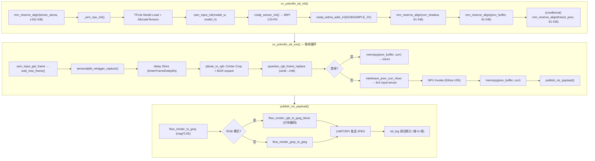

# Plan 016：主链路内存地图、延迟优化与调试清理

> **状态**: 📋 待审阅 | **日期**: 2026-02-26

---

## 1. 主程序链路流程图

---

## 2. 内存占用详图

### 2.1 动态分配 (mm_reserve_align, 来自 SRAM heap)

| 分配项                | 大小           | 来源                   | 说明                                                                |
| :-------------------- | :------------- | :--------------------- | :------------------------------------------------------------------ |
| `tensor_arena`        | **1432 KiB**   | `cvapp init`           | NPU 推理核心，Vela 报告峰值 1188 KiB (144×192) / 1430 KiB (150×200) |
| `g_jpegautofill_addr` | **0.1 KiB**    | `cisdp_wdma_addr_init` | JPEG autofill metadata                                              |
| `g_wdma1_baseaddr`    | **18.75 KiB**  | `cisdp_wdma_addr_init` | HW2x2 output (320×240/4)                                            |
| `g_wdma3_baseaddr`    | **225 KiB**    | `cisdp_wdma_addr_init` | RAW Planar RGB (320×240×3)                                          |
| `g_curr_q_shadow`     | **81 KiB**     | `cvapp init`           | 当前帧量化后 shadow (144×192×3)                                     |
| `g_prev_q_buffer`     | **81 KiB**     | `cvapp init`           | 上一帧量化后 buffer (144×192×3)                                     |
| `g_freeze_prev_q`     | **81 KiB**     | `cvapp init`           | ⚠️ `FLOW_DBG_FREEZE_PAIR` 专用，当前应为 disabled                    |
| **动态分配合计**      | **≈ 1919 KiB** |                        |                                                                     |

### 2.2 静态分配 (.bss.NoInit, 不占用 SRAM heap)

| 分配项                 | 大小         | 来源              | 说明                            |
| :--------------------- | :----------- | :---------------- | :------------------------------ |
| `g_flow_viz_gray`      | **38.6 KiB** | `viz_publish.cpp` | 灰度渲染缓存 (176×224)          |
| `g_flow_viz_jpeg`      | **24 KiB**   | `viz_publish.cpp` | JPEG 编码输出                   |
| `g_flow_viz_rgb_block` | **5.25 KiB** | `viz_publish.cpp` | RGB 分块渲染 (8 rows × 224 × 3) |
| `kFallbackInvokeJpeg`  | **0.07 KiB** | `viz_publish.cpp` | 硬编码 fallback JPEG            |
| **静态分配合计**       | **≈ 68 KiB** |                   |                                 |

### 2.3 总内存预算

| 区域                        | 物理大小  | 当前占用  | 剩余          |
| :-------------------------- | :-------- | :-------- | :------------ |
| **SRAM Heap** (≈ 1.9 MiB)   | ~1945 KiB | ~1919 KiB | **~26 KiB** ⚠️ |
| **.bss.NoInit** (共享 SRAM) | 占用      | ~68 KiB   | —             |

---

## 3. 优化选项分析

### 选项 A：移除 `FLOW_DBG_FREEZE_PAIR` 调试缓冲区 [已执行 - 2026-02-26]

|              | 详情                                                                                    |
| :----------- | :-------------------------------------------------------------------------------------- |
| **释放内存** | **81 KiB**                                                                              |
| **操作**     | 删除 `cvapp_yolov8n_ob.cpp` L365-377 的 `#if FLOW_DBG_FREEZE_PAIR` 块，以及所有相关变量 |
| **风险**     | ⚡ 无。该功能仅用于"冻结帧对"调试，从未在生产中使用                                      |
| **效果**     | 可将 `tensor_arena` 从 1432 KiB 提升到 **~1513 KiB**，为 150×200 模型提供 83 KiB 余量   |

### 选项 B：降低摄像头采样到 SUBSAMPLE_4X (160×120)

|              | 详情                                                                           |
| :----------- | :----------------------------------------------------------------------------- |
| **释放内存** | **168 KiB** (WDMA3 从 225 KiB 降至 56.25 KiB, WDMA1 从 18.75 KiB 降至 4.8 KiB) |
| **操作**     | `cam_input.cpp` 中的 `APP_DP_RES_RGB640x480_INP_SUBSAMPLE_2X` → `4X`           |
| **风险**     | ⚠️ 高。160×120 需要上采样到 150×200，会引入模糊，**严重影响光流精度**           |
| **适用场景** | 仅当模型输入分辨率 ≤ 160×120 时才有意义                                        |

### 选项 C：复用 `curr_shadow` 与 `prev_buffer`，消除一个缓冲区

|              | 详情                                                                                                                                                          |
| :----------- | :------------------------------------------------------------------------------------------------------------------------------------------------------------ |
| **释放内存** | **81 KiB**                                                                                                                                                    |
| **操作**     | 不再为 `prev` 和 `curr` 分别分配独立缓冲；而是在 interleave 完成后，直接在 `input tensor` 内部读取 prev 数据。需要重写 interleave 逻辑为"就地"(in-place) 模式 |
| **风险**     | ⚠️ 中。需要仔细验证 NPU invoke 是否会覆盖 input tensor 内容（Ethos-U55 通常不会），以及 DMA 竞态                                                               |
| **效果**     | 可将 `tensor_arena` 提升到 **~1513 KiB**                                                                                                                      |

### 选项 D：缩小 BSS 可视化缓冲 [已执行 - 2026-02-26]

|              | 详情                                                                                                             |
| :----------- | :--------------------------------------------------------------------------------------------------------------- |
| **释放内存** | **~14 KiB**                                                                                                      |
| **操作**     | 将 `kFlowVizMaxPixels` 和 `kFlowVizRgbBlockSize` 从硬编码值改为使用 centralized constants (`FLOW_MODEL_IN_W` 等) |
| **风险**     | ⚡ 低。由于通过 `common_config.h` 联动，安全性极高                                                                |
| **效果**     | 释放约 11.5 KiB (gray) + 2.8 KiB (rgb_block) ≈ 14 KiB                                                            |

### 选项 E：精简 `ob_debug_stats` 模块 [已执行 - 2026-02-26]

|              | 详情                                                                                                                                 |
| :----------- | :----------------------------------------------------------------------------------------------------------------------------------- |
| **释放内存** | **~2-5 KiB** (代码段瘦身)                                                                                                            |
| **操作**     | `ob_log_col_mean_mag_sample` 当前未被调用，可删除。`ob_log_out_q_histogram` 和 `ob_log_mag_stats_grid_sample` 可在确认产品稳定后移除 |
| **风险**     | ⚡ 无。这些是纯诊断函数，不影响光流输出                                                                                               |
| **效果**     | 主要减小 Flash 占用和代码复杂度，SRAM 节省有限                                                                                       |

### 选项 M：水平镜像翻转 (Mirroring) —— 修复视觉透视

|              | 详情                                                                                                                                                                                                  |
| :----------- | :---------------------------------------------------------------------------------------------------------------------------------------------------------------------------------------------------- |
| **操作**     | 在 [cisdp_cfg.h](file:///home/enmin/Seeed_Grove_Vision_AI_Module_V2/EPII_CM55M_APP_S/app/scenario_app/optical_cam_oflow/cis_sensor/cis_hm0360/cisdp_cfg.h) 中修改 `#define CIS_MIRROR_SETTING (0x01)` |
| **原理**     | **硬件级翻转**。直接在 sensor 层面开启 H-Mirror，不产生 CPU 消耗。                                                                                                                                    |
| **联动优化** | HAL 已自动处理 Bayer Pattern 变换（从 `BGGR` 变为 `GBRG`），无需手动在 ISP 层面修改颜色解析逻辑。                                                                                                     |
| **效果**     | 画面呈“镜面效果”（如挥动左手，光流显示在屏幕左侧），更符合自拍/人机交互直觉。整个光流计算链路都会同步翻转，输出对齐。                                                                                 |

---

## 4. 延迟优化分析

### 当前延迟构成 (估算)

| 阶段                          | 估计耗时                    | 可优化性   |
| :---------------------------- | :-------------------------- | :--------- |
| `kInterFrameDelayMs = 33ms`   | **33 ms**                   | ✅ 高       |
| `planar_to_rgb` (Center Crop) | ~2-5 ms                     | ⚡ 低       |
| `quantize_rgb_frame_inplace`  | ~1-2 ms                     | ⚡ 低       |
| `interleave_prev_curr_nhwc`   | ~3-5 ms                     | 🟡          |
| **NPU Invoke**                | ~50-80 ms                   | ❌ 硬件限制 |
| `flow_render + JPEG encode`   | ~5-15 ms                    | 🟡          |
| UART/SPI 传输                 | ~5-10 ms                    | ⚡ 低       |
| **总计**                      | **~100-150 ms** (~7-10 FPS) |            |

### 延迟优化选项

| 方案                           | 节省                     | 操作                                                          | 风险                                   |
| :----------------------------- | :----------------------- | :------------------------------------------------------------ | :------------------------------------- |
| **L1: 降低帧间延迟**           | **~20 ms**               | `kInterFrameDelayMs` 从 33ms 降至 10-15ms                     | ⚠️ 中。可能导致 DMA 撕裂，需要逐步测试  |
| **L2: Helium 加速 interleave** | **~2-3 ms**              | 用 ARM Helium (MVE) SIMD 向量化 interleave 循环               | ⚡ 低。纯性能优化                       |
| **L3: 跳帧策略**               | **帧率不变，延迟感知优** | 每 2 帧跳过一次 viz_publish，减少 JPEG 编码频率               | ⚡ 低。预览刷新率降低但光流计算保持全速 |
| **L4: 异步 JPEG**              | **~5-10 ms**             | 将 JPEG 编码和传输放到下一帧的 `cam_input_get_frame` 等待期间 | ⚠️ 中。需要引入双缓冲机制               |

---

## 5. 调试遗留清理建议

| 遗留项                            | 位置                              | 类型     | 建议                         |
| :-------------------------------- | :-------------------------------- | :------- | :--------------------------- |
| `FLOW_DBG_FREEZE_PAIR` 及相关变量 | `cvapp_yolov8n_ob.cpp` L365-377   | 废弃调试 | ✅ **删除** (释放 81 KiB)     |
| `kFallbackInvokeJpeg` 硬编码序列  | `viz_publish.cpp` L39-46          | 容错     | 🟡 保留 (回退用)              |
| `find_jpeg_payload` 暴力搜索      | `viz_publish.cpp` L53-88          | 容错     | 🟡 保留 (ISP JPEG 偶尔不对齐) |
| `g_last_good_jpeg_addr` 重发机制  | `viz_publish.cpp` L248-253        | 容错     | 🟡 保留                       |
| `ob_log_col_mean_mag_sample`      | `ob_debug_stats.cpp` L154-199     | 死代码   | ✅ **删除** (未被调用)        |
| `compute_checksum_from_q` × 2     | `cvapp_yolov8n_ob.cpp` L433, L445 | 调试     | 🟡 可移除，每帧省 ~1 ms       |
| `ob_perf` 多段计时                | `cvapp_yolov8n_ob.cpp` L394-401   | 诊断     | 🟡 保留 (对延迟分析有价值)    |
| `input_ptr[0..11]` 首帧打印       | `cvapp_yolov8n_ob.cpp` L439-443   | 调试     | ⚡ 已限制为前 3 帧，影响极微  |
| 空行冗余 (L121-130)               | `cvapp_yolov8n_ob.cpp`            | 代码风格 | ✅ **清理**                   |

---

## 6. 推荐优先级

综合内存释放与风险，推荐的执行顺序：

1.  **选项 A** (删 FREEZE_PAIR) + **选项 D** (缩 BSS viz) + **选项 E** (删死代码)
    → 释放 **~96 KiB**，零风险
2.  **延迟 L1** (降低帧间延迟到 15ms)
    → 需使用 `we2-optical-sd-pipeline` 技能烧录测试
3.  如果仍需更多内存：评估 **选项 C** (复用缓冲区)
    → 需仔细验证 NPU input tensor 行为

---

## 7. 验证计划

| 步骤               | 方法                                       | 相关技能                       |
| :----------------- | :----------------------------------------- | :----------------------------- |
| 内存优化后编译验证 | `make clean && make`                       | `we2-optical-sd-pipeline`      |
| 烧录并抓帧对比     | `run_optical_pipeline.sh --extract-frames` | `we2-optical-sd-pipeline`      |
| 延迟验证           | 观察 UART 日志中的 `total_us`              | `we2-himax-iterative-debug`    |
| Windows 可视化确认 | Himax AI Web Toolkit 预览                  | `windows-observation-workflow` |
| 完成后通知         | Discord webhook                            | `discord-notify-wsl2`          |
| 文档同步           | 更新 plan-000 和 KNOWLEDGE_BASE            | `project-governance`           |
